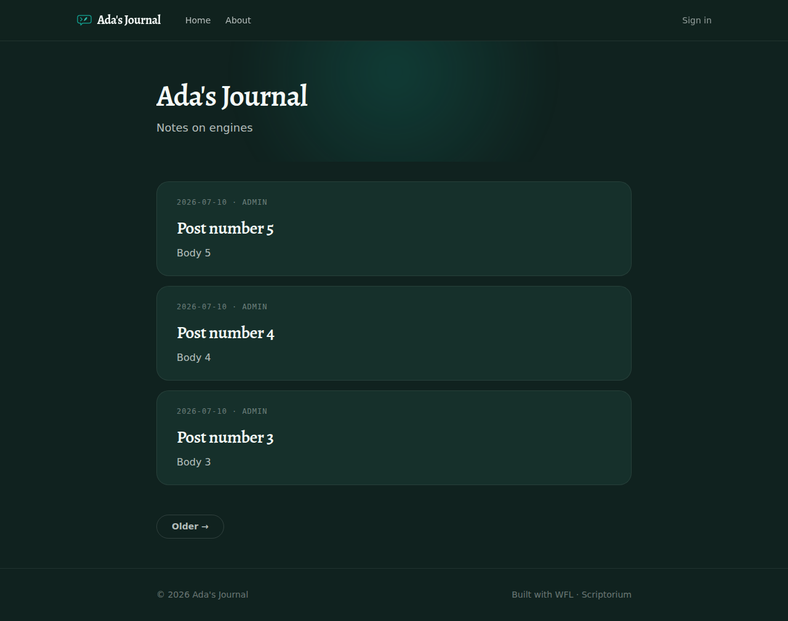
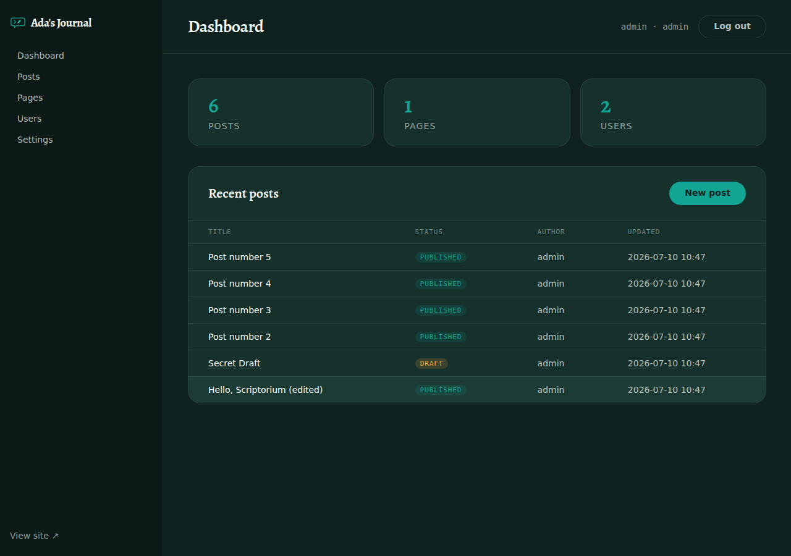
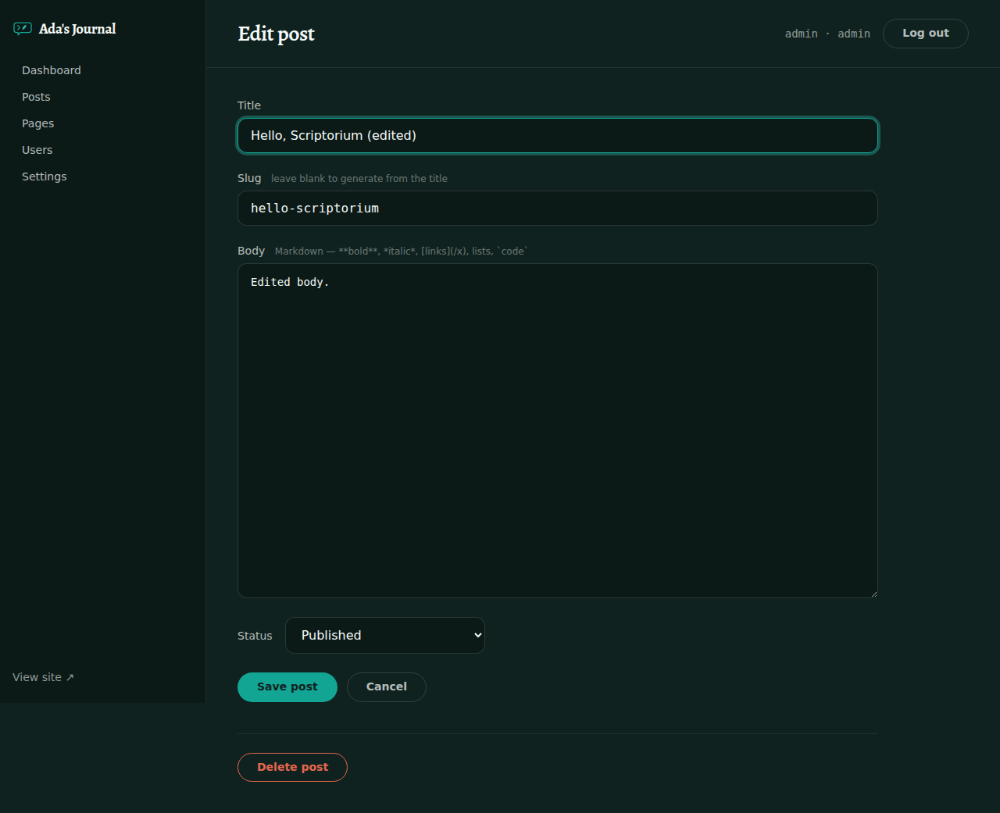
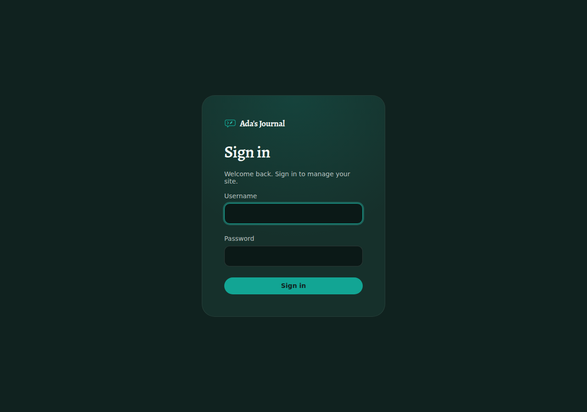

# Scriptorium

A small, WordPress-style **content management system written entirely in
[WFL](https://github.com/WebFirstLanguage/wfl)** — the WebFirst Language, where
programs read like plain English. Scriptorium serves a public blog/site and a
login-protected admin panel, persists everything in **SQLite**, renders pages
with the **[Scribe](https://github.com/WebFirstLanguage/scribe)** templating
engine, and is styled with the **WFL Design System** (dark, teal-on-Ink).



## Features (MVP)

- **Public site** with a base theme: home feed with pagination, single-post
  pages, standalone pages, and a site nav — all server-rendered.
- **Admin panel** (`/admin`): dashboard, and full CRUD for **posts**, **pages**,
  **users**, and **site settings**.
- **Markdown** authoring — post/page bodies are written in Markdown and rendered
  with Scribe's safe `markdown` filter (HTML-escaped, dangerous links neutralised).
- **Media uploads** — a media library (`/admin/media`) with image uploads
  (multipart, up to 10 MiB), served from `/assets/uploads/`, plus an upload
  panel right in the post/page editors.
- **Multiple users with roles**:
  - **admin** — manages users, settings, and *all* content.
  - **author** — creates and edits *their own* posts and pages.
- **Sessions & auth** rolled on WFL's Argon2id password hashing
  (`hash_password` / `verify_password`), a random session id in an `HttpOnly`
  cookie, and a server-side `sessions` table.
- **CSRF protection** on every admin form (per-session tokens, compared in
  constant time; the login form uses a double-submit cookie), and **per-IP
  login rate limiting** (10 failures / 15 minutes → 429).
- **WFL routing** — dispatch uses WFL's `route` construct plus `path_params`
  for `/post/:slug`, `/admin/posts/:id/edit`, and friends.
- **Design system** — every screen uses the WFL Design System tokens
  (Alegreya display serif, Verdant Teal accent, Ink surfaces, pill buttons,
  20px card radius).
- **Swappable themes** — the public site is built from reusable **sections** and
  assembled into pages: every page is a **header** + a **body** + a **footer**,
  in that order (`themes/base/`). See [`docs/THEMING.md`](docs/THEMING.md).

| Admin dashboard | Post editor | Sign in |
|---|---|---|
|  |  |  |

## Quick start

You need the WFL interpreter (`wfl`) on your PATH. Scriptorium keeps the
[Scribe](https://github.com/WebFirstLanguage/Scribe) template engine as a git
submodule, so clone with submodules:

```sh
git clone --recurse-submodules https://github.com/WebFirstLanguage/Scriptorium.git
```

(Already cloned without them? `git submodule update --init --recursive`.)

Then, **from the repository root** (template and asset paths resolve relative to
the working directory):

```sh
wfl main.wfl
```

On first run Scriptorium creates `scriptorium.db`, seeds default settings, and
locks the site behind a **one-page installer**. The console does not print a
password:

```text
Scriptorium is running at http://127.0.0.1:8080
  First run — open http://127.0.0.1:8080/install to set up your site
```

Open <http://127.0.0.1:8080/> — you will be sent to `/install`. Choose a site
title, tagline, admin username, and password. When setup finishes you are
signed in at `/admin`. Add more users (admins or authors) under **Users**.

> Bind address and TLS are set in `.wflcfg`. The server listens on
> `127.0.0.1:8080` by default; set `web_server_bind_address = 0.0.0.0` to expose
> it behind a reverse proxy.

### Data directory (containers, backups)

By default Scriptorium keeps `scriptorium.db` in the working directory and
uploads under `static/uploads/` — fine for a local run, but scattered across the
app tree. Set **`data_dir`** in `.wflcfg` to consolidate *all* mutable state
under one directory:

```ini
# .wflcfg
data_dir = /var/lib/scriptorium
```

Scriptorium then keeps the database at `<data_dir>/scriptorium.db` and uploads at
`<data_dir>/uploads/` (still served at `/assets/uploads/*`), creating the
directory if needed. This cleanly separates *the app* (immutable, replaceable —
a container image, a `git` deploy) from *the site* (precious, backed up): mount
one volume at `data_dir` and a redeploy can never destroy your content. Leaving
`data_dir` unset keeps the legacy layout, so existing installs are unaffected.

For Docker, point it at the volume mount and mount a single directory:

```yaml
# compose (sketch)
volumes:
  - ./data:/var/lib/scriptorium   # holds scriptorium.db + uploads/
```

## Routes

All state lives in the **path** (or in POST bodies) — stable, shareable URLs.

| Method | Path | What |
|---|---|---|
| GET | `/` · `/blog/page/:n` | Home feed (paginated) |
| GET | `/post/:slug` | A published post |
| GET | `/page/:slug` | A published page |
| GET | `/assets/*` | Static files (CSS, fonts, logo, uploads) |
| GET/POST | `/install` | First-run wizard (locked after setup; late POST is ignored) |
| GET/POST | `/admin/login` · `/admin/logout` | Auth (logout is POST-only) |
| GET | `/admin` | Dashboard |
| GET | `/admin/posts` · `/admin/posts/new` · `/admin/posts/:id/edit` | Posts: list, new form, edit form |
| POST | `/admin/posts` · `/admin/posts/:id` · `/admin/posts/:id/delete` | Posts: create, update, delete *(GET → 405)* |
| GET/POST | `/admin/pages…` | Pages CRUD (same shape, same method split) |
| GET | `/admin/media` | Media library |
| POST | `/admin/media/upload` | Upload *(GET redirects to `/admin/media`)* |
| POST | `/admin/media/:id/delete` | Delete *(GET → 405)* |
| GET/POST | `/admin/users…` | Users CRUD *(admin only; delete is POST-only)* |
| GET/POST | `/admin/settings` | Site settings *(admin only)* |

Every admin POST must carry the session's CSRF token (rendered into each form
as a hidden `csrf_token` field) — requests without it get a 403.

## Project layout

```text
main.wfl              Boot (open DB, migrate, backfill) + request loop + router + handlers
.wflcfg               WFL runtime config (bind address, TLS, body-size cap, data_dir)
app/
  util.wfl            slugify, to_int, field_or, truncate, file_ext/stem, config_value_from (parsing is stdlib)
  db.wfl              SQLite schema + every query/execute helper
  auth.wfl            passwords, sessions, CSRF tokens, role checks
  render.wfl          shared "site" context + Scribe wrappers
lib/scribe/           Scribe template engine — git submodule of WebFirstLanguage/Scribe
scripts/update-scribe.sh  Bump the Scribe submodule to the newest upstream commit
themes/base/          Default theme: sections/ (header, footer) + templates (skeleton, assembler, bodies)
themes/README.md      Theme layout at a glance
admin/templates       Admin panel templates
static/               WFL Design System (ds/) + theme.css + admin.css
static/uploads/       Uploaded media (default; relocates under data_dir when set)
TestPrograms/         WFL test suites (wfl --test)
docs/                 Architecture notes + THEMING.md + PROJECT-LAYOUT.md + screenshots
```

> **Building something new on WFL or Scriptorium?** The layout above is
> Scriptorium's own, and it predates the house standard.
> [`docs/PROJECT-LAYOUT.md`](docs/PROJECT-LAYOUT.md) is the shape a **new**
> project should take — `src/` modules as containers behind a single composition
> root, themes split into `header/ body/ footer/`, `tests/` mirroring `src/`.
> Scriptorium is explicitly grandfathered and is not being retrofitted.

## Tests

```sh
wfl --test TestPrograms/util.test.wfl   # helpers (slugify, file_ext, parsing, …)
wfl --test TestPrograms/db.test.wfl     # data layer against sqlite::memory:
wfl --test TestPrograms/auth.test.wfl   # sessions + CSRF token checks
```

## Keeping Scribe current

The template engine is not vendored as a copied file any more — `lib/scribe` is
a **git submodule** pointing at
[WebFirstLanguage/Scribe](https://github.com/WebFirstLanguage/Scribe), and
`app/render.wfl` includes it from `../lib/scribe/src/scribe.wfl`. Improvements
to Scribe now flow into Scriptorium instead of having to be re-applied by hand.

One thing to know up front: **a submodule records one exact Scribe commit.**
That is what makes a checkout reproducible — everyone gets the Scribe that was
tested against this Scriptorium — but it also means Scribe moving forward does
*not* move Scriptorium on its own. Something has to bump the pin:

```sh
scripts/update-scribe.sh --check   # is there a newer Scribe? (changes nothing)
scripts/update-scribe.sh           # bump lib/scribe to the tip of Scribe main
wfl --test TestPrograms/scribe.test.wfl  # the suite a Scribe bump can break
wfl --test TestPrograms/util.test.wfl    # …and the rest (see Tests), then:
git commit -m "chore(scribe): update lib/scribe"
```

`.github/workflows/update-scribe.yml` does the same thing on a weekly schedule
(and on demand via *Run workflow*), opening a PR with the Scribe commits it
picked up. Delete that file if you would rather bump by hand only.

Working on Scribe itself? `lib/scribe` is a normal git checkout — commit and
push from inside it, then bump the pin here.

## Security notes

- Passwords are stored only as Argon2id hashes; login uses `verify_password`.
- Every SQL statement is **parameterised** — user input is never spliced into SQL.
- Output is **auto-escaped** by Scribe; Markdown is rendered through a safe subset.
- Session cookies are `HttpOnly` + `SameSite=Lax`; static serving rejects `..`.
- **CSRF**: every admin POST form carries a per-session token (hidden
  `csrf_token` field), validated with `constant_time_equals` before anything
  mutates; the login form and the first-run installer use a double-submit
  cookie since no session exists yet. Every mutating route is POST-only, so
  nothing can slip past the token check: a GET on an update or delete route
  returns 405, and a GET on `/admin/logout` is a no-op that redirects to
  `/admin` (it does *not* end the session, so an ``
  cannot log anyone out).
- **Rate limiting**: more than 10 failed logins (or installer posts) from one
  IP within 15 minutes → `429` until the window passes. (A crude in-app
  limiter — see `docs/ARCHITECTURE.md` for why a robust one wants upstream
  support.)
- **Uploads**: images only (`png/jpg/jpeg/gif/webp`; no SVG — it can script),
  stored under a server-generated name, capped by `web_server_max_body_size`
  (10 MiB in `.wflcfg`).

## Built on

- **WFL** — the language, runtime, built-in web server, SQLite, and crypto.
- **Scribe** — Twig-style templating, tracked as a git submodule at `lib/scribe`
  (see [Keeping Scribe current](#keeping-scribe-current)).
- **WFL Design System** — brand tokens, fonts, and the logo mark (`static/ds/`).

See [`docs/ARCHITECTURE.md`](docs/ARCHITECTURE.md) for how the pieces fit and the
WFL constraints that shaped the design.

## License

Apache-2.0. See [LICENSE](LICENSE).
